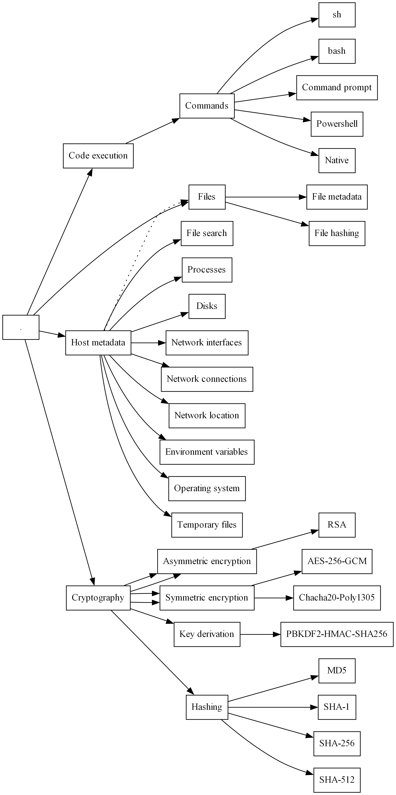

# hodgepodge

This repository contains a hodgepodge of Go code that is used in various projects.

> 👷 🚧: this project is experimental, doesn't have a stable API, and is under active development.

## Features

The following features are available:

| Name                          | Functional area | Description                                                     | Notes                                                                                                      |
| ----------------------------- | --------------- | --------------------------------------------------------------- | ---------------------------------------------------------------------------------------------------------- |
| Collect environment variables | Data collection | Collect environment variables as sequences of key/value pairs.  |                                                                                                            |
| Collect file metadata         | Data collection | Collect file metadata (e.g. size, traits, MACb timestamps)      |                                                                                                            |
| Collect system metadata       | Data collection |                                                                 |                                                                                                            |
| Collect system metrics        | Data collection | Measure disk usage.                                             |                                                                                                            |
| Discover network location     | Data collection | Hostname, primary network interface.                            |                                                                                                            |
| Encrypt/decrypt files         | Data collection | Encrypt/decrypt files using symmetric or asymmetric encryption. | RSA is used for asymmetric encryption. AES-256-GCM or ChaCha20-Poly1305 are used for symmetric encryption. |
| Hash files                    | Data collection | Hash files using a variety of common hash functions.            | Supported hash functions are MD5, SHA-1, SHA-256, SHA-512.                                                 |
| List disks                    | Data collection |                                                                 |                                                                                                            |
| List network connections      | Data collection |                                                                 |                                                                                                            |
| List network interfaces       | Data collection |                                                                 |                                                                                                            |
| List running processes        | Data collection |                                                                 |                                                                                                            |
| Search for files              | Data collection | Search for files by path or filename.                           |                                                                                                            |
| Execute shell commands        | Code execution  | Execute shell commands and capture their output.                | Supports executing commands in a sh, bash, Powershell, or Command Prompt session.                          |
